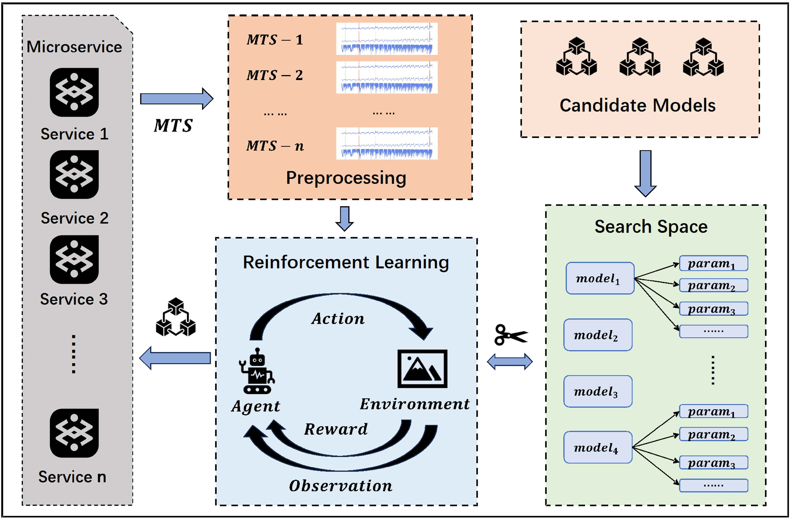

# RL-ADS

Thrilled to share that our paper has been accepted for publication in *The Journal of Supercomputing*. Full citation as follows:
```
Liu, F., Dai, Z. & Dou, H. Efficient deployment of multivariate time series anomaly detection models using reinforcement learning. J Supercomput 82, 459 (2026). https://doi.org/10.1007/s11227-026-08613-3
```

RL-ADS is a reinforcement learning-based framework for automated deployment of multivariate time series anomaly detection models in AIOps environments. By dynamically selecting and configuring candidate detectors for different microservices, RL-ADS reduces deployment overhead and improves adaptability in large-scale distributed systems.

## Directory
```
~/RL-ADS
│  README.md
│
├─My_envs
│  │  RLAD_MaskablePPO.py
│  │
│  ├─data                           # processed dataset & labels
│  └─my_envs                        # reinforcement learning environment
│      │  __init__.py
│      │
│      ├─envs
│      │      envs_RLAD.py          # Agent mapping, RL search logic and pruning algorithm configuration
│      │      __init__.py
│      │
│      ├─lib
│      │      mask.py               # mask operations
│      │      parameter.py          # hyperparameter space
│      │      __init__.py
│      │
│      └─wrapper
│              deploy_model.py      # Model deployment & invocation
│              __init__.py
│
└─space
    └─model                         # Stores candidate models: InterFusion, mtad-gat-pytorch, OmniAnomaly, SDFVAE
```


## Datasets
1. **SMAP & MSL**
https://www.kaggle.com/datasets/patrickfleith/nasa-anomaly-detection-dataset-smap-msl
2. **SMD**
https://github.com/NetManAIOps/OmniAnomaly
3. **Sockshop**
https://zenodo.org/records/10107954?utm_source=chatgpt.com


## Environment
1. InterFusion
https://github.com/zhhlee/InterFusion
2. mtad-gat-pytorch
https://github.com/ML4ITS/mtad-gat-pytorch
3. OmniAnomaly
https://github.com/NetManAIOps/OmniAnomaly
4. SDFVAE
https://github.com/dlagul/SDFVAE


## Usage
1. Environment setup
```bash
   conda create -n rl-ads python=3.9
   conda activate rl-ads
   pip install -r requirements.txt
```
2. Install InterFusion, mtad-gat-pytorch, OmniAnomaly, SDFVAE  
Clone and install the four candidate models under `space/model/`.
3. Preprocess dataset  
Download and process under `My_envs/data/`.
4. Run
```bash
python My_envs/RLAD_MaskablePPO.py <dataset>
```